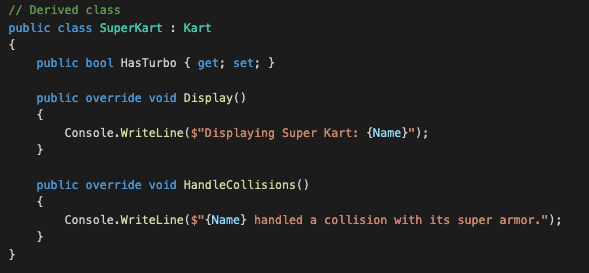

**Projet de session pour le cours 420jv7AS**

Ce répositoire continent la hiérarchie classe et le code pour le projet de session basé sur [Unity3d](https://unity.com/products/unity-engine) et c#. 

*Auteurs*: @sdpoueme

# Hiérarchie de classe




> [!NOTE]
> Ce cours contient des objets provenant de [supertuxkart](supertuxkart.org).


- classe a: Kart

| Attribut | Fonctions |
|---------:|-----------|
| Name | public getName(), public setName() |
| Speed | private setSpeed(), public getSpeed() |
| HasTurbo | private isTurboEnabled() |

```c#
   public class Kart
   {
     public string Name { get; set }

     public void Display()
     {
        //TODO: add the details of the function
     }
   }

```


- classe b: Track
  
| Attribut | Fonctions |
|---------:|-----------|
| Name | public getName(), public setName() |
| Type | private setTrackType() |
| Obstacles | private addObstacles () |

- classe c: Mode


# Manuel d'utilisation

# Tests


